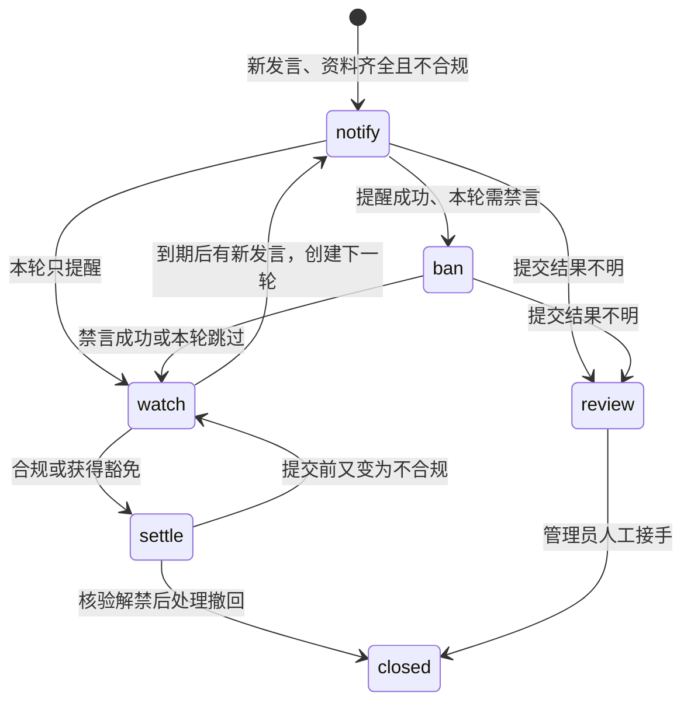

# 实现与维护

## 模块边界

| 模块 | 职责 |
| --- | --- |
| `main.py` | AstrBot 注册、事件接入、私聊命令和资源关闭 |
| `config.py` | 表单校验、不可变策略、模板和参数范围 |
| `rules.py` | 纯规则判断、资料解析、正则超时、提醒指纹 |
| `service.py` | 事件持久化、成员资料核验、轮次决策、调度和人工暂停 |
| `executor.py` | 等待后再次核验、写操作、禁言归属、解禁及撤回 |
| `platform.py` | 唯一账号路由、连接代次、OneBot 协议、读取预算 |
| `store.py` | 单工作线程中的 SQLite 事务，业务代码通过异步入口调用 |
| `resources.py` | 跨平台实例锁、完整 JSON 日志、脱敏和存储健康检查 |
| `commands.py` | 易读的私聊命令、群管理权限验证与人工接手 |

插件不导入或修改其他插件。共享操作队列是可选能力，缺失时使用自己的账号锁和持久化间隔；存在但不符合协议时暂缓操作。

## 状态流转

创建新一轮会把上一轮 `watch` 事项标为 `archived`。旧提醒 ID 继续保存；成员合规后连同新提醒一起核验撤回。等待期间合规、豁免、离群、切换规则或连接代次变化，会取消尚未提交的处罚。关闭新检查开关不会停止已有事项的跟进。

`review` 不做自动写入或轮询推断，必须人工核对后接手。提醒或禁言不明时，为账号设置持久化暂停，其他已知事项的解禁/撤回仍可继续。一个账号的多个不明事项全部交接后才能恢复。

## 写入顺序和并发

1. 接收事件先更新内存代次，随后通过数据库串行工作线程落盘；群聊正文不入库。
2. 定时任务不持有数据库事务等待网络。成员锁避免重复轮次，账号锁限制同时写入。
3. 随机等待用持久化截止时间表达，调度器不会因等待一名成员而整体休眠。
4. 接入共享队列时，排队结束后才重新读取机器人权限、全员禁言、目标资料和入群身份。新处罚使用两次一致的群名片/入群时间核验。
5. 在数据库中预先保留一次性操作意图和额度。每事项每操作类型有唯一约束。
6. 在实际传输的独立任务中，最后同步检查成员、机器人、群通知代次、配置、连接、资料时效及运行健康，然后调用 OneBot。
7. 明确未发送的意图可以释放。请求可能已经发出时，无论超时还是取消，都保留“不明”记录，不重复提交。
8. 记录结果并延长账号操作间隔。记录失败即停止操作；不以丢弃审计记录换取继续运行。

最多四个成员任务并发，并限制新增处理占用的调度槽位；跟进任务优先取出，读取预算分层预留。已有共享队列不承诺本插件的解禁会抢占其他插件正在执行的操作。

禁言归属需要成功提交记录、匹配的自身通知、相同入群身份和相符的截止时间。中途解除、延长或其他不匹配通知使归属失效。不因管理员提前解禁就在本轮补禁；下一轮依然需要新的发言和原有冷却结束。

## 重载、故障和数据

- SQLite 使用 WAL 和 `synchronous=FULL`，只在单线程中访问；取消调用会等待已提交的数据库任务结束。
- 启动把遗留 `submitted` 视为 `unknown`，不会回放旧发言；未提交的旧处罚取消，已知提醒和禁言保留跟进。
- 进程实例锁防止两个加载实例同时操作同一数据库，Linux 用 `flock`，Windows 用字节锁。
- 普通启动只对新处罚缓冲；连接变化、网络异常和管理员恢复使用独立持久化冷却。小幅调整配置不会缩短已安排的截止时间。
- 系统时间与单调时钟差异跳变超过 120 秒会停止操作；启动时也拒绝显著回退的时钟。
- 日志写入/轮转失败、数据库写入失败、磁盘容量不足或队列积压都暂停自动操作。不要删除数据库来“恢复”，这会丢失归属、额度和重复提交防护。

## 扩展建议

新增保护条件应优先扩展 `Policy` / `parse_policy` 和 `judge`，以资料缺失时暂缓为原则。新增平台字段放在 `Member.parse` 或 `Adapter`，避免在命令、规则里读取平台原始结构。

新增写操作必须经过意图持久化、最终代次检查、额度和未知结果分支，不在事件处理函数直接调用平台。变更数据库结构时显式迁移 `PRAGMA user_version`；持久化的策略快照也必须兼容旧版本。

需特别保留的回归测试：等候时改名/升管理、离群重进、撤回失败仍解禁、通知缺失不误解禁、同账号其他插件介入、传输前取消与传输后中断、配置关闭仍跟进，以及不完整资料不得处罚。
